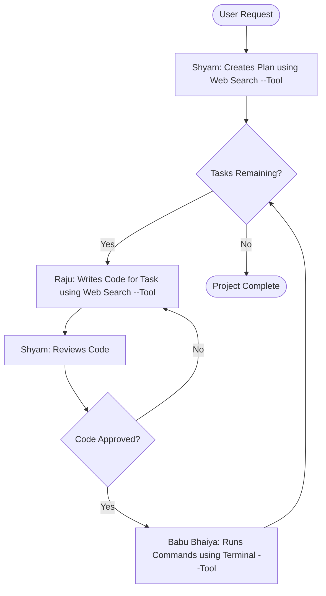

# Hera Pheri: An Autonomous AI Coding Crew 🤖

[](https://opensource.org/licenses/MIT)
[](https://www.python.org/downloads/)
[](https://github.com/langchain-ai/langgraph)

An experimental autonomous AI agent system built with LangGraph that plans, writes, reviews, and executes code to complete complex tasks. The system is inspired by the iconic characters from the movie *Hera Pheri*, with each agent embodying a unique persona and role.

-   **Shyam:** The meticulous planner and reviewer.
-   **Raju:** The fast-moving, clever coder.
-   **Babu Bhaiya:** The reliable operator who interacts with the terminal.

## Core Concept

The project demonstrates a multi-agent collaboration pattern where complex tasks are broken down and handled by specialized AI agents. This "separation of concerns" creates a robust and fault-tolerant system:

1.  **Planning:** Shyam receives a high-level goal and creates a detailed, step-by-step execution plan.
2.  **Coding & Review Loop:** Raju takes one task at a time and writes the necessary code, which is then passed to Shyam for rigorous review. If the code fails review, it's sent back to Raju with feedback. This loop ensures code quality.
3.  **Execution:** Once a piece of code is approved by Shyam, it's handed to Babu Bhaiya, who is the only agent with permission to execute terminal commands (like writing to files, running git, etc.).

## Workflow Diagram

This diagram illustrates the core logic and flow of control between the agents.


## Folder Structure

The project is organized as follows:

```
Hera-Pheri/
├── .venv/                   # Virtual environment managed by uv
├── data/                    # Persistent data (e.g., database)
│   └── conversations.duckdb   # DuckDB database file
├── src/                     # Application source code
│   └── hera_pheri/
│       ├── __init__.py
│       ├── agents/              # Core agent logic and graph
│       │   ├── __init__.py
│       │   ├── definitions.py   # Agent node functions (Shyam, Raju, Babu)
│       │   ├── graph.py         # LangGraph assembly and compilation
│       │   ├── state.py         # AgentState TypedDict definition
│       │   └── tools.py         # Tool definitions
│       ├── database/            # DuckDB interaction layer
│       │   ├── __init__.py
│       │   ├── connection.py    # Manages DuckDB connection
│       │   └── operations.py    # Save/load conversation functions
│       ├── tui/                 # Textual User Interface components
│       │   ├── __init__.py
│       │   ├── app.py           # Main Textual App class
│       │   └── widgets.py       # Custom TUI widgets
│       └── config.py            # Loads .env configuration
├── .env                     # Secret API keys (gitignored)
├── .env.example             # Example environment file
├── .gitignore               # Git ignore file
├── README.md                # Project documentation
├── main.py                  # Main entry point
└── pyproject.toml           # Project dependencies and metadata
```

## Tech Stack

-   **Framework:** LangGraph
-   **LLM Integration:** LangChain-Groq
-   **Package Manager:** uv
-   **Tools:** Tavily Search (for web research)

## Getting Started

### Prerequisites

-   Python 3.9+
-   Git
-   [uv](https://github.com/astral-sh/uv) installed on your system.

### Installation

1.  **Clone the repository:**
    ```sh
    git clone https://github.com/datasciritwik/Hera-Pheri.git
    cd Hera-Pheri
    ```

2.  **Create and activate a virtual environment using `uv`:**
    ```sh
    uv venv
    source venv/bin/activate
    # On Windows, use: venv\Scripts\activate
    ```

3.  **Install the dependencies:**
    ```sh
    uv pip install -r requirements.txt
    ```

4.  **Set up environment variables:**
    Create a file named `.env` in the root of the project by copying the example file:
    ```sh
    cp .env.example .env
    ```
    Now, open the `.env` file and add your API keys:
    ```env
    GROQ_API_KEY="sk-..."
    TAVILY_API_KEY="tvly-..."
    ```

## How to Run

Execute the main agent script from your terminal:

```sh
python hera_pheri_crew.py
```

You will see the agents interacting in the console as they work to complete the task defined inside the script.

## The Agents in Detail

### 🤵 Shyam (The Planner & Reviewer)
-   **Persona:** Logical, cautious, and meticulous. Believes in doing things the "right" way.
-   **Role:** Takes the initial user request, breaks it down into a sequence of executable steps, and reviews all code generated by Raju for quality and correctness.
-   **Tools:** `web_search`

### 👨‍💻 Raju (The Coder)
-   **Persona:** Impulsive, action-oriented, and clever. Always looking for the fastest way to get things done.
-   **Role:** Receives a single, well-defined task from Shyam and writes the code or command to accomplish it.
-   **Tools:** `web_search`

### 👳‍♂️ Babu Bhaiya (The Operator)
-   **Persona:** The landlord who just wants things to work without any fuss. Doesn't care about the details, only about the final action.
-   **Role:** The only agent with the authority to interact with the system environment. He executes approved commands in the terminal.
-   **Tools:** `execute_terminal_command`

---

## ⚠️ Security Warning

This project uses an AI agent (`Babu Bhaiya`) that can **execute arbitrary terminal commands**. This is extremely powerful and potentially dangerous. It can modify your file system, access sensitive information, and interact with the internet.

**It is strongly recommended to run this project in a sandboxed, isolated environment, such as a Docker container, to prevent unintended consequences.**

## Contributing

Contributions are welcome! If you have ideas for new features, tools, or improvements to the agent logic, feel free to open an issue or submit a pull request.

1.  Fork the repository.
2.  Create your feature branch (`git checkout -b feature/AmazingFeature`).
3.  Commit your changes (`git commit -m 'Add some AmazingFeature'`).
4.  Push to the branch (`git push origin feature/AmazingFeature`).
5.  Open a Pull Request.

## License

This project is licensed under the MIT License - see the [LICENSE](LICENSE) file for details.